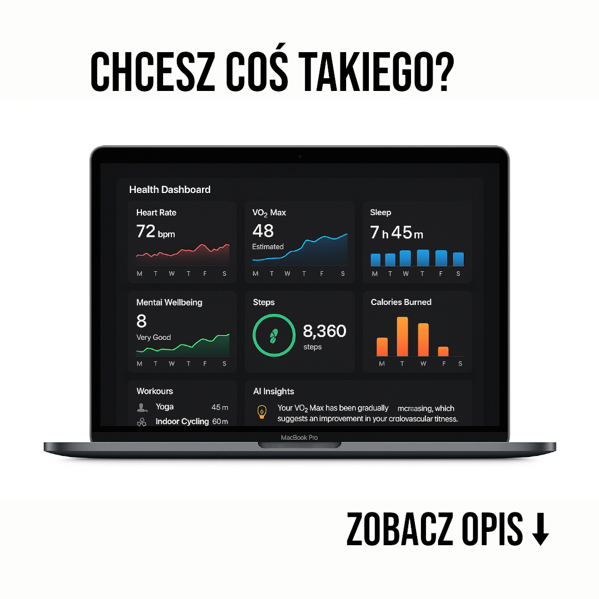

## Post na FB

Masz Apple Watch'a i korzystasz z niego by śledzić swoje postępy?

... a Apple Health nie wystarcza do zrozumienia twojego dobrostanu zdrowotnego i potrzebujesz czegoś więcej?

Stworzyliśmy specjalnie dla ciebie aplikację Better Apple Health, która:
✅ Czytelnie i przejrzyście prezentuje twoje parametry zdrowotne oraz pokazuje trendy
✅ Jest centrum twoich wszystkich cyfrowych narzędzi zdrowotnych - zbiera nie tylko dane z Apple Watch'a, ale także innych aplikacji trzecich (np. MyFitnessPal), które wspierają Apple Health
✅ Składa Ci cotygodniowy raport zdrowotny na podstawie twoich celów i zaleca działania

Jej konfiguracja jest za to bardzo prosta, wystarczy pobrać aplikację na iPhone'ie i ustawić bezpieczną synchronizację danych 🔒

Zainteresowany? Kliknij w ten link, by otrzymać 7 dniowy okres próbny 👇

[link do landing page'a]

## Post na IG

(Chcesz coś takiego? / zobacz opis)

Istnieje lepszy sposób na śledzenie twojego zdrowia przy użyciu Apple Watch'a 🤓☝️

Nie ograniczaj się do _ograniczonych_ wykresów z Apple Health 🤦

Zobacz swoje parametry zdrowotne w pełnej ich okazałości i wykonaj swoją pierwszą pełną analizę dobrostanu swojego zdrowia na twoim komputerze z systemem operacyjnym macOS. (link w bio)
